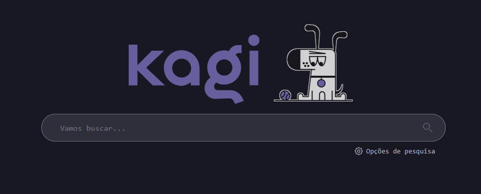

# 🎨 Envoy Kagi CSS

> A sleek, dark theme for Kagi search engine inspired by Hacker Monokai

[
[
[

✨ Overview

Envoy Kagi CSS is a stylish dark theme for the Kagi search engine that brings a modern, eye-pleasing aesthetic to your search experience. While initially inspired by maxpl01t's Kagi Hacker Monokai theme, this style offers its own unique look and feel with carefully chosen color schemes and visual enhancements.

# 📷 Preview

Start Page

Search Results

# 🚀 Installation

    Subscribe to Kagi Search if you haven't already
    Go to Settings → Appearance → Custom CSS
    Copy the CSS from envoy.css
    Paste the code into the Custom CSS section
    Save your changes and enjoy your new theme!

# 🧰 Customization

Feel free to fork this repository and customize the CSS to match your personal preferences. The code is well-commented to help you navigate through different sections.
⚙️ Compatibility

This theme has been tested with the latest version of Kagi search and works with most modern browsers including:

    Chrome/Edge
    Firefox
    Safari

# 🙏 Credits

    Original inspiration: Kagi Hacker Monokai by maxpl01t
    Kagi Search for providing a customizable search platform

🤝 Contributing

Contributions, issues, and feature requests are welcome! Feel free to check the issues page.

Made with ❤️ by the last envoy
